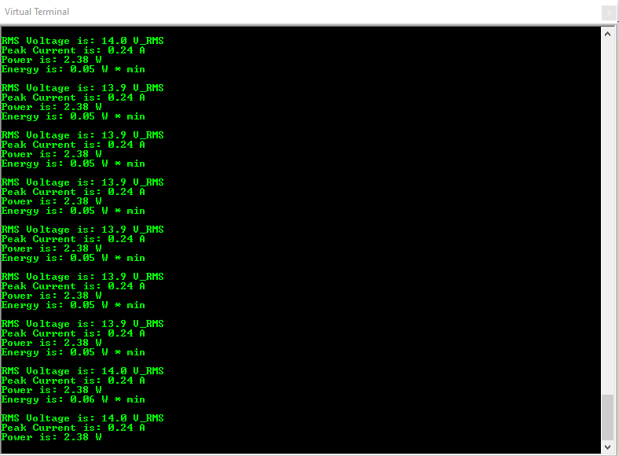

This project is being developed by a team of 4.

It consists of analogue and digital design.

The analogue design has been developed in LTSpice, and the file is located under Hardware >> SpiceModel. 

The digital design can be built and compiled with Atmel Studio, and simulated in Proteus using the .ELF file. This is located under Firmware >> Final_Project. 

Altium has been used for the PCB, and the files can be located under PCB >> PCB_FINAL.

The aim of this project is to virtually implement an energy monitor which measures the voltage,
current, power, and energy supplied to a load. The design specifications require implementation of this 
project across an Xplained Mini 328PB microcontroller and Bluetooth LE module using ADC conversion and 
UART transmission. Several tools are used in the design process such as LTSpice to design and validate 
the analogue schematic. A corresponding PCB has been designed using Altium designer. The embedded software 
design has been implemented in Atmel Studio and the output is simulated on a virtual oscilloscope using Proteus.

